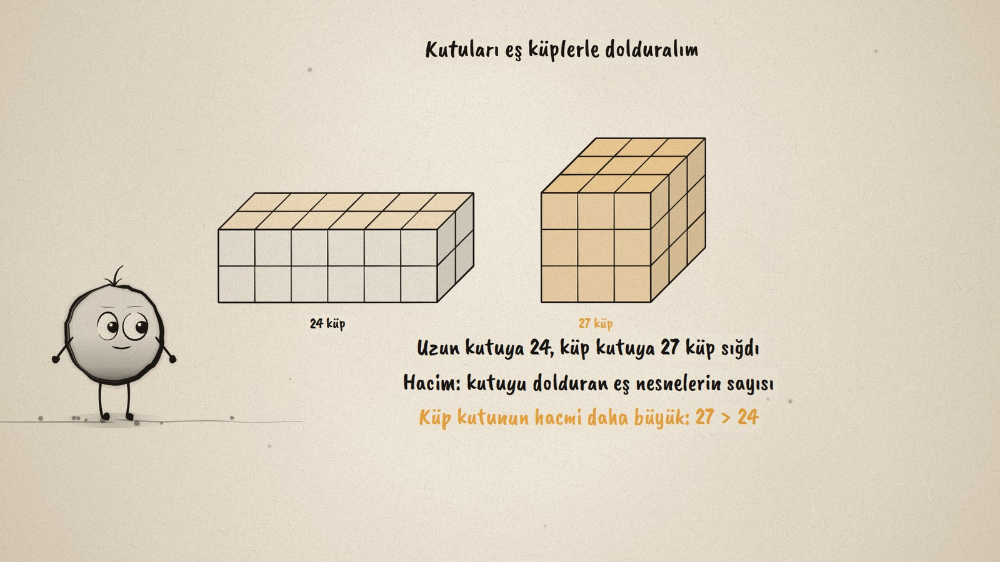
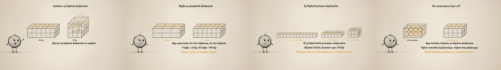

# Kutuya Kaç Tane? · Volume with Equal Objects

**▶ Tarayıcıda izleyin / Watch in the browser:** https://hakanatas.github.io/kutuya-kac-tane/ 
**⬇ MP4 + altyazılar / MP4 + subtitles:** [Releases](https://github.com/hakanatas/kutuya-kac-tane/releases) 
**✎ Kullanılan istem / The prompt behind it:** [PROMPT.md](PROMPT.md) 
**🎞 Bütün filmler / All films:** [Nokta'nın Filmleri](https://hakanatas.github.io/nokta-filmleri/?sinif=7)

> **TR —** 7. sınıf matematik "Geometrik Nicelikler" temasındaki MAT.7.4.3 öğrenme çıktısı için hazırlanmış, tamamen JavaScript ile çizilen 92 saniyelik mürekkep animasyonu. İki kutu var: uzun olanı daha büyük görünüyor. İkisi de eş küplerle dolduruluyor ve sayılıyor: uzun kutuya 24, küp biçimli kutuya 27 küp sığıyor, yani küp biçimli kutunun hacmi daha büyük. Aynı uzun kutu bir kez tuğlalarla (12 tuğla), bir kez küplerle (24 küp) dolduruluyor: hacim, seçilen eş nesneyle söyleniyor. 12 eş küple üç farklı prizma kuruluyor (12 × 1 × 1, 6 × 2 × 1, 3 × 2 × 2): biçimleri farklı, hacimleri aynı. Son olarak toplarla doldurulan kutuda boşluklar kalıyor, küpler kutuyu tam dolduruyor: hacmi boşluksuz dolduran eş nesnelerle ölçeriz. Altyazılar Türkçe, İngilizce ya da ikisi birlikte seçilebilir.

A 92-second ink animation for **7th-grade maths**. Nokta, the ink character from [The Learning Ink](https://github.com/hakanatas/the-learning-ink), is the guide again. Every box is filled by one function, `fillBox` in `scenes/scene1.js`: it lists the slots layer by layer, drops the objects in one by one (cubes, 2-cube bricks or balls) and draws the glass walls around them, and the running count on screen comes from the same timing.

## Learning outcome

MEB, Türkiye Yüzyılı Maarif Modeli, Ortaokul Matematik, 7th grade, "Geometrik Nicelikler" theme:

**MAT.7.4.3. Dikdörtgenler prizmasının hacmini eş nesneler aracılığıyla yorumlayabilme**
- a) Dikdörtgenler prizmalarının hacimlerini karşılaştırarak inceler.
- b) Eş nesneler ile doldurulmuş dikdörtgenler prizmasını oluşturur.
- c) Dikdörtgenler prizmasını oluşturan eş nesnelerin sayısını prizmanın hacmi olarak ifade eder.

## Scenes

| # | Time | Scene | What happens | Outcome |
|---|---|---|---|---|
| 1 | 0–10 s | İki kutu | A long box and a cube-shaped box: which holds more? | a |
| 2 | 10–28 s | Eş küpler | Both are filled with equal cubes: 24 and 27, so the cube box is bigger. | a, b, c |
| 3 | 28–46 s | Başka nesne | The long box holds 12 bricks or 24 cubes: 1 brick = 2 cubes. | b, c |
| 4 | 46–64 s | Prizma kur | 12 equal cubes build three different prisms with the same volume. | b, c |
| 5 | 64–80 s | Top mu küp mü? | Balls leave gaps, cubes fill the box completely. | c |
| 6 | 80–92 s | Aklında kalsın | Volume is the number of equal objects that fill the prism without gaps. | a–c |

## Running it

- **Preview:** double-click `index.html` (it works offline).
- **MP4:** run `npm install` once, then `npm run export -- --format=horizontal --captions=tr`.
- **Subtitles and narration:** `npm run srt` writes `out/captions_*.srt` and `narration_notes.txt`.
- **Editing:**
  - Caption text, timings and narration notes: `captions.js`
  - Everything on screen is drawn by `LI.world(t)` in `scenes/scene1.js` (the boxes, the cubes, the words); the other scenes only set the camera.
  - Nokta's poses: `src/draw/film.js`; layout for 16:9 and 9:16: `src/draw/kd.js`

It uses the same engine as The Learning Ink: `renderFrame(t)` as a pure function of time, seeded randomness, and frame-by-frame export.

## Lisans · License

**TR —** Bu film ve kodu [Creative Commons Atıf-GayriTicari 4.0 Uluslararası (CC BY-NC 4.0)](https://creativecommons.org/licenses/by-nc/4.0/deed.tr) lisansıyla paylaşılır. Ticari olmayan her amaçla (derste, okulda, eğitim materyalinde) kopyalayabilir, paylaşabilir ve değiştirebilirsiniz; ancak **kaynak göstermek zorunludur**: eser sahibinin adı ve bu deponun bağlantısı belirtilmeden kullanılamaz. Ticari kullanım (satış, ücretli ürün ya da yayın) için izin alınmalıdır.

**EN —** This film and its code are licensed under [Creative Commons Attribution-NonCommercial 4.0 International (CC BY-NC 4.0)](https://creativecommons.org/licenses/by-nc/4.0/). You may copy, share and adapt them for non-commercial purposes, but **attribution is required**: they may not be used without crediting the author and linking to this repository. Commercial use requires permission.

Atıf örneği / Required credit: *“Kutuya Kaç Tane?”, Hakan Ataş, Nokta'nın Filmleri — https://github.com/hakanatas/kutuya-kac-tane — CC BY-NC 4.0*
